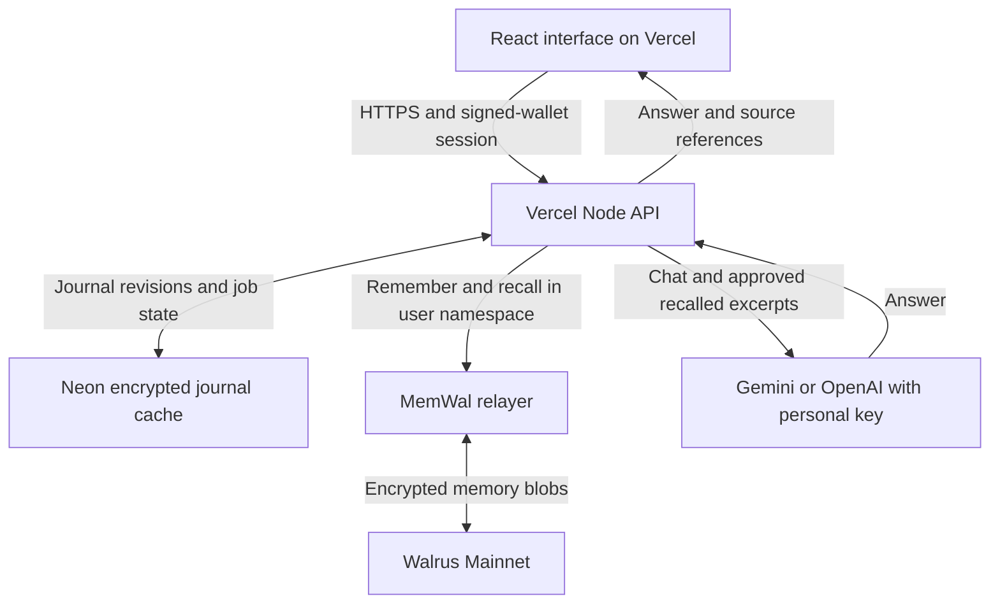

<div align="center">

# WalPen

### *A quiet journal. A companion that remembers what you choose.*

English · Tiếng Việt · Sui wallet sign-in · Walrus Memory · Cloud AI / local Ollama

[](https://thewalrussessions.wal.app/chatbots/index.html)
[](docs/IMPLEMENTATION-STATUS.md)

[](https://walpen.vercel.app)
[](docs/MEMWAL-PR-INTEGRATION.md)
[](https://github.com/Olympusxvn/WalPen)

[](package.json)
[](package.json)
[](package.json)
[](server/memory.ts)
[](server/llm.ts)


*Concept illustration, not an application screenshot.*

> Write a page → approve a memory excerpt → return to a fresh conversation.

</div>

WalPen is a journaling app for people who want continuity between conversations and a clear choice about which parts of their writing a chatbot may recall. Users write their own entries, select an editable memory excerpt, and receive answers with references to relevant saved pages.

**Storage and consent are separate:** saving uploads the journal record to Walrus Mainnet. Approval determines which excerpt may enter the chatbot's context. Chat messages are not automatically saved as memories.

**Current status — 30 September 2026:** the frontend and API run on Vercel with Neon persistence. Slush currently shows a **“Malicious website”** warning during wallet testing. The owner has submitted a review request; clearance has not been confirmed. Do not bypass the warning. See the [review notes](docs/SLUSH-REVIEW.md) and [changelog](CHANGELOG.md).

<a id="contents"></a>
## 📑 Contents

| Explore | Build and operate |
|:---|:---|
| [For reviewers](#for-reviewers) | [Quick start](#quick-start) |
| [Journal and memory workflow](#workflow) | [Configuration](#configuration) |
| [Architecture](#architecture) | [Scripts and verification](#scripts) |
| [Mainnet evidence](#mainnet) | [Deployment](#deployment) |
| [MemWal contributions](#contributions) | [Privacy and recovery](#privacy) |
| [Documentation](#documentation) | [Project status](#status) |

<a id="for-reviewers"></a>
## 🔎 For reviewers

**Run on your own computer:** follow [SETUP.md](SETUP.md), then run `npm run setup:local`. It prepares a separate local profile, installs dependencies, downloads the Ollama model and starts WalPen. A journal-only option is available without Ollama; Walrus memory requires your own MemWal credentials.

**[Live demo](https://walpen.vercel.app):** the intended wallet flow is **VI/EN → Connect Sui wallet → approve a personal sign-in message**, with invitation code `walpen-sessions-2026` on the first visit. Slush access remains blocked pending review, so this is not yet a verified Slush onboarding path. The application requests no transaction or gas payment for sign-in.

Cloud chat requires your Gemini or OpenAI API key in **Settings**. Your provider's model access, quotas and charges apply. A successful response using a real cloud-provider key remains unverified; the recorded answer-quality examples below used local Ollama. The website and API operate without the developer's computer running.

Existing password accounts can sign in using **Existing account / password sign-in**, then link a Sui wallet in Settings. Linking keeps their journal and existing Walrus namespace. See the [friend testing guide](docs/FRIEND-TEST-GUIDE.vi.md) and [deployment evidence](docs/CLOUD-DEPLOYMENT.md).

1. Write a short fictional entry with a fact you can check, such as a planned activity.
2. Select the excerpt the companion may remember, approve it, save, and wait for **Saved on Walrus**.
3. Open a fresh chat, enable memory, and ask about that fact. Inspect the source card and blob ID.
4. Start another fresh chat with memory disabled and ask the same question in the same language.
5. Withdraw the excerpt from future use, then start a fresh conversation to check the change.

To check the code without making Mainnet writes or calling an LLM, use Node.js 24.x:

```bash
npm ci
npm test
npm run build
```

| 🔗 Resource | 📍 What to inspect |
|:---|:---|
| [Implementation status](docs/IMPLEMENTATION-STATUS.md) | Verified behavior, remaining work and operating limits |
| [MemWal integration notes](docs/MEMWAL-PR-INTEGRATION.md) | Token budgeting, deletion filtering and the deployed test |
| [Integration tests](tests/app.test.ts) | User isolation, consent, revisions and write recovery |
| [Memory budget tests](tests/memory-context.test.ts) | Whole excerpts, Unicode, source limits and estimates |
| [Wallet tests](tests/wallet.test.ts) | Signature verification, replay prevention, expiry and existing-account linking |
| [Cloud integration test](tests/postgres.integration.ts) | Persistence and synchronization across application instances using PostgreSQL |

<a id="workflow"></a>
## 🌿 Journal and memory workflow

| Capability | Behavior |
|:---|:---|
| Write and revisit | Journal pages, moods, search, per-user drafts, immutable revisions and JSON/Markdown export |
| Choose what the companion recalls | Editable excerpts with explicit approval; memory on/off for each conversation |
| Continue across sessions | Semantic recall from Walrus with entry dates and blob IDs in source cards |
| Keep context bounded | Up to five approved sources and 768 estimated memory-context tokens; complete excerpts are retained |
| Change your mind | Withdrawn and superseded entries are filtered out; a concurrent edit or withdrawal prevents returning an obsolete answer |
| Use either language | English/Vietnamese interface, remembered language preference, localized dates and model response language |
| See the actual storage state | Pending, confirmed, failed and uncertain outcomes; service errors are shown instead of simulated success |

Switching the interface language does not translate or overwrite journal content. The companion supports reflection; it is not intended to diagnose users or write their diary for them.

<a id="architecture"></a>
## 🏗️ Architecture



| Layer | Responsibility |
|:---|:---|
| [React + Vite](src/App.tsx) | Journal editor, consent controls, chat and bilingual navigation |
| [Express API](server/app.ts) | Authentication, server-side user isolation, revision checks and background write handling |
| [MemWal adapter](server/memory.ts) | `MemWal.create()`, `remember()`, `waitForRememberJob()` and `recall()` |
| [Context budget](server/memory-context.ts) | Filtered excerpts bounded with SDK helpers before generation |
| [Model adapters](server/llm.ts) | Gemini/OpenAI personal keys in cloud; Ollama/Qwen for local use; language instructions and citation handling |
| [Cloud store](server/postgres-store.ts) / [local store](server/store.ts) | Encrypted journal payloads, accounts, sessions and recovery state |
| [Wallet sign-in](server/wallet-auth.ts) | Sui personal signatures, browser-bound single-use challenges, linking to existing accounts |

The API derives namespaces from authenticated user IDs. A verified wallet maps to a stable ID; an address supplied by the browser alone cannot authorize recall. After recall, the API validates blob identity, the active revision, consent and the approved excerpt before passing context to the selected model. It checks selected sources again after generation to catch edits or withdrawals made while the model was answering.

The 768-token budget covers the serialized memory context only. It uses MemWal's character-based estimate, not exact model tokenization or a limit on the entire prompt.

<a id="quick-start"></a>
## ⚡ Quick start

**Prerequisites:** Node.js **24.x**, npm, [Ollama](https://ollama.com/download), and a Walrus Memory account with a delegate key for live storage.

```bash
git clone https://github.com/Olympusxvn/WalPen.git
cd WalPen
npm ci
```

Create your configuration once. In PowerShell:

```powershell
Copy-Item .env.example .env
node -e "console.log(require('crypto').randomBytes(32).toString('hex'))"
```

On macOS/Linux, use `cp .env.example .env` instead. Put the generated hex value in `DATA_ENCRYPTION_KEY`, fill in the remaining settings below, and keep the file local. Preserve an existing `.env` and encryption key when updating an installation.

```bash
ollama pull qwen3:4b-instruct-2507-q4_K_M
npm run dev
```

Ensure Ollama is running. Open **http://localhost:5173** and use Sui wallet sign-in, or choose the password form to register with at least 10 characters. This pilot has no password-reset flow.

<details>
<summary><strong>Serve the production build locally</strong></summary>

Set `APP_MODE=development` and `APP_ORIGIN=http://localhost:3001` in your local `.env`, then run:

```bash
npm run build
npm start
```

Open **http://localhost:3001**. The development frontend uses port 5173; the standalone build uses port 3001. Public deployments use the HTTPS configuration described below.

</details>

<a id="configuration"></a>
## ⚙️ Configuration

Use [.env.example](.env.example) as the starting point. Delegate credentials are read by the backend and must never be placed in a frontend `VITE_*` variable.

| Variable | Local setup |
|:---|:---|
| `DATA_ENCRYPTION_KEY` | Your generated 64-character hex key; retain it with your backup plan |
| `MEMWAL_ACCOUNT_ID` | Your MemWalAccount object ID |
| `MEMWAL_PRIVATE_KEY` | Your private delegate key |
| `MEMWAL_SERVER_URL` | `https://relayer.memory.walrus.xyz` |
| `LLM_PROVIDER` | `ollama` |
| `LLM_MODEL` | `qwen3:4b-instruct-2507-q4_K_M` |
| `LLM_BASE_URL` | `http://127.0.0.1:11434` |
| `APP_MODE` | `development` locally; `production` for the public demo |
| `APP_ORIGIN` | `http://localhost:5173` for development |
| `PORT` | `3001` by default |
| `INVITE_CODE` | Optional locally; required in production |
| `DATABASE_PATH` | Optional; defaults to `data/walpen.sqlite` |

For the documented local Ollama setup, leave `LLM_API_KEY` empty. The historical recall evidence below used Qwen/Ollama. The cloud deployment uses personal Gemini/OpenAI keys and does not require Ollama; its server configuration is described in [CLOUD-DEPLOYMENT.md](docs/CLOUD-DEPLOYMENT.md).

<a id="mainnet"></a>
## ⛓️ Mainnet evidence

**Cloud verification — 30 September 2026:** migrated-account login and journal retrieval passed. A fictional entry submitted through the cloud API received a confirmed Walrus blob receipt, and public API health remained successful after the local API and tunnel stopped. Twenty-seven local tests and one live-Neon integration test passed. A synthetic unfunded wallet completed production sign-in and retained its session after reload; that test did not exercise Slush's security screening. See [deployment evidence and limits](docs/CLOUD-DEPLOYMENT.md).

Earlier verification through **29 September 2026**, using the local API/Ollama deployment:

| Check | Recorded result |
|:---|:---|
| Initial Mainnet verification | Ten distinct confirmed blobs, followed by recall from a new client |
| Browser journal | A separate page saved through the app and opened through the public deployment |
| Five fictional pages | All five questions returned the expected fact and source after recovery from three failed writes |
| Public recall on 29 September | Correct park / 20-minute answer, five sources, 201 estimated memory-context tokens, about 80 seconds on the local CPU host |
| Automated validation | 16 tests and production build passed for commit [`3edbe27`](https://github.com/Olympusxvn/WalPen/commit/3edbe27c084f022df79b4e345317c67c677f2af1) |

These are synthetic test results, not claims of real-user adoption or general model accuracy. The five pages carry different journal dates but were created and tested on 19 September.

<details>
<summary><strong>Public demo identifiers and local evidence files</strong></summary>

| Identifier | Value |
|:---|:---|
| MemWalAccount object ID | `0xd7ec125eb467c0cce65b219ff7ddeea217c16709077c2c48c183e47e80704287` |
| Delegate public key | `3d459de074104123300bb8ccc4367d24cf3c6e7656edcbe46ab1f91d10a4415f` |
| Network | Walrus Mainnet |

The account object ID is not a prize-recipient wallet address. These identifiers refer to the demo; use your own account and private delegate credentials when running a separate installation.

Local evidence is intentionally excluded from Git:

- `data/evidence/walrus-verification.json` — initial jobs, blob IDs and fresh-client recall.
- `data/evidence/public-e2e.json` — memory-off / memory-on responses.
- `data/evidence/five-days.json` and `five-days-report.md` — fictional-page checks and recovery results.
- `data/evidence/pr-integration-live.json` — public check after the MemWal integration update.
- `data/evidence/cloud-cutover-2026-09-30.json` — cloud API checks and confirmed fictional Walrus write.
- `data/evidence/cloud-wallet-auth.json` — production authentication with a synthetic wallet, not a Slush clearance test.

Public summaries are in [implementation status](docs/IMPLEMENTATION-STATUS.md), [integration notes](docs/MEMWAL-PR-INTEGRATION.md) and the [incident report](docs/MEMWAL-ENCRYPTION-INCIDENT.md).

</details>

<a id="contributions"></a>
## 🔌 MemWal contributions and adoption

WalPen adopts two improvements associated with earlier Session 7 feedback and adds three reports from the Session 8 build.

| Contribution | Connection to WalPen |
|:---|:---|
| [#591](https://github.com/MystenLabs/MemWal/issues/591) / [PR #885](https://github.com/MystenLabs/MemWal/pull/885) | The discussion separated asynchronous write timing from Security Delete behavior. The PR addresses the narrower server-side deletion filter; it does not establish a general stale-after-forget bug. |
| [#592](https://github.com/MystenLabs/MemWal/issues/592) / [PR #605](https://github.com/MystenLabs/MemWal/pull/605) | SDK token budgeting now bounds WalPen's approved memory context while retaining complete excerpts. |
| [#277](https://github.com/MystenLabs/MemWal/issues/277), related to #592 | Earlier Special One feedback on serverless latency and bounded recall context. #592 proposes token accounting at the SDK boundary; time budgets and token budgets address different limits. |
| [#1047](https://github.com/MystenLabs/MemWal/issues/1047) | Historical encryption-backend failures, with job IDs, timing and subsequent recovery evidence. |
| [#1048](https://github.com/MystenLabs/MemWal/issues/1048) | A durable recovery guide for timeouts and process restarts using existing SDK APIs. |
| [#1049](https://github.com/MystenLabs/MemWal/issues/1049) | A proposed read-only receipt lookup by idempotency key when the original job ID was lost. |

The hosted relayer's reported build contains #885's exclusion query; runtime activation depends on its schema/configuration. WalPen retains its own consent and revision checks. The receipt-lookup API in #1049 remains a proposal. See [integration boundaries](docs/MEMWAL-PR-INTEGRATION.md).

<a id="scripts"></a>
## 🧪 Scripts and verification

| Command | Purpose and requirements |
|:---|:---|
| `npm run dev` | Watch the API and serve the Vite frontend |
| `npm test` | Isolated automated tests; no Mainnet writes or model calls |
| `npm run test:cloud` | Live PostgreSQL integration test; requires `WALPEN_TEST_DATABASE_URL` pointing to a test database with permission to create an isolated schema |
| `npm run build` | Type-check and build the frontend |
| `npm start` | Start the API and serve an existing `dist/` build |
| `npm run check:secrets` | Check source files for configured secret values; not a comprehensive secret detector |
| `npm run backup` | Create a consistent encrypted SQLite snapshot |
| `npm run verify:walrus` | **Real Mainnet writes:** ten fictional facts and fresh-client recall; requires configured MemWal access and available storage funding |
| `npm run verify:public` | Live login and chat check; requires `E2E_USERNAME`, `E2E_PASSWORD`, the demo's riverside-memory fixture and a running backend/model |
| `npx tsx scripts/test-five-days.ts` | Live fictional-page evaluation; may create entries or replacement revisions and make Mainnet writes |

Live API checks default to `https://walpen.vercel.app`; set `E2E_BASE_URL` to test your deployment. Keep test credentials local. The Mainnet verification script persists jobs in `data/evidence/`, resumes known jobs, skips confirmed blobs and stops on ambiguous submissions rather than blindly reposting.

<a id="deployment"></a>
## 🌐 Deployment

**Vercel hosts the frontend and API.** Neon holds durable application state; MemWal persists and recalls memories on Walrus Mainnet. Personal Gemini/OpenAI keys provide online inference. No local API, Ollama process or tunnel is needed for the public deployment.

1. Connect a Neon database and set the server secrets described in [CLOUD-DEPLOYMENT.md](docs/CLOUD-DEPLOYMENT.md).
2. Back up and migrate any existing SQLite data with the operator migration script; preserve the original encryption key and user IDs.
3. Build and deploy using Vercel CLI. [vercel.json](vercel.json) routes `/api/*` to the bundled function; [.vercelignore](.vercelignore) excludes local secrets and data.
4. Verify a signed-wallet session, confirmed Walrus write and recall in a fresh chat with a valid personal AI key. Record service failures honestly.

Synchronization uses a database claim before submitting a memory and Vercel `waitUntil()` for bounded background work. Job IDs survive function restarts; journal requests resume pending work. The legacy tunnel helper refuses to overwrite a cloud API configuration.

<a id="privacy"></a>
## 🔒 Privacy, consent and recovery

- Journal payloads in Neon (cloud) or SQLite (local) use **AES-256-GCM**. Sui sign-in verifies a personal message with a five-minute, single-use, browser-bound challenge. Legacy passwords use salted scrypt; production sessions use HttpOnly/SameSite/Secure cookies.
- The hosted MemWal relayer processes plaintext for embedding and encryption. The backend can decrypt the cache, and the selected AI provider receives the chat input and approved recalled excerpts. Personal API keys stay in the tab's session storage and pass through the backend for chat; they are not saved to Neon or Walrus. This is not end-to-end encryption or a fully offline application.
- The pilot uses a shared MemWal account with namespaces derived server-side. This provides application-level user isolation, not independent cryptographic ownership for every user.
- **Stop remembering** excludes an entry from future prompts and creates a stored revision. It does not delete old Walrus blobs or erase text already returned in a conversation.
- Recalled content is treated as untrusted data. WalPen has no tool-executing agent; model resistance to malicious text is not a formal guarantee.

### Back up and restore

```bash
npm run backup
```

For local installations, snapshots are stored under `data/backups/`. For cloud, use Neon database backup/export facilities and retain the original encryption key separately. Changing the key without migrating encrypted records makes those records unreadable.

To restore a **local SQLite installation**, stop WalPen, point `DATABASE_PATH` to a copy of a snapshot, keep the same `DATA_ENCRYPTION_KEY`, and restart. Test the copy on a separate port before replacing the live database. Snapshots preserve user mappings, current revisions and withdrawn-memory state. This procedure does not restore the production Neon database.

MemWal's `restore` repairs its search index; it does not reconstruct WalPen accounts or the local database. Full recovery from Walrus alone is not implemented. JSON/Markdown exports preserve readable journal content, not the complete account state.

<a id="documentation"></a>
## 📚 Documentation

| 📄 Document | 📍 Purpose |
|:---|:---|
| [Changelog](CHANGELOG.md) | Cloud migration, wallet authentication, fixes and known limitations |
| [Cloud deployment](docs/CLOUD-DEPLOYMENT.md) | Vercel/Neon configuration, completed migration and verification |
| [Friend testing guide](docs/FRIEND-TEST-GUIDE.vi.md) | Vietnamese onboarding and real multi-day feedback collection |
| [Slush review](docs/SLUSH-REVIEW.md) | Reported website warning, completed checks and submitted-review status |
| [Implementation status](docs/IMPLEMENTATION-STATUS.md) | Verified results and outstanding work |
| [MemWal PR integration](docs/MEMWAL-PR-INTEGRATION.md) | #605/#885 adoption and validation |
| [Article draft](docs/ARTICLE-EN.md) | Build story, before/after and integration lessons; not yet published on Medium/Inkray |
| [Submission checklist](docs/SUBMISSION-CHECKLIST.md) | Readiness against Event Rules and remaining tasks |
| [Editorial notes](docs/ARTICLE-EDITORIAL-NOTES.md) | Keywords, evidence sources and writing constraints |
| [Encryption incident](docs/MEMWAL-ENCRYPTION-INCIDENT.md) | Evidence behind #1047 |
| [Recovery documentation ticket](docs/MEMWAL-RECOVERY-DOCS-TICKET.md) | Scope of #1048 |
| [Receipt lookup ticket](docs/MEMWAL-RECEIPT-LOOKUP-TICKET.md) | Scope of #1049 |
| [Submission draft](docs/SUBMISSION-DRAFT.md) | Project description and evidence to prepare |
| [Issues and contributions](ISSUE.md) | Recall backlog, upstream evidence, prior core contributions and Session 8 follow-ups |

<details>
<summary><strong>Earlier proposals and related resources</strong></summary>

- [Original feedback drafts](docs/MEMWAL-FEEDBACK-PROPOSALS.md) — historical drafts superseded by the published recovery tickets.
- [Structured recovery proposal](docs/MEMWAL-JOB-RECOVERY-FEATURE.md) — an additional unsubmitted idea.
- [MemWal source and issues](https://github.com/MystenLabs/MemWal).
- [Walrus Sessions Event Rules](https://thewalrussessions.wal.app/chatbots/index.html).
- [DeepSurge event page](https://www.deepsurge.xyz/hackathons/c0141a4a-21be-4009-bc63-7c168608c849).
- [Pause & Pen](https://github.com/Olympusxvn/pause-and-pen) — the original product inspiration.

</details>

<a id="status"></a>
## ✅ Project status

- [x] Bilingual journal, personal-key cloud AI adapters, and optional local Qwen companion.
- [x] Confirmed Mainnet writes, including a cloud write; earlier local/Ollama fresh-session recall with source references.
- [x] Consent/revision filtering, memory budgeting and recovery tests.
- [x] Cloud frontend/API, Neon state, and documented local setup.
- [x] Sui signature authentication verified with a synthetic wallet; existing-account linking covered by tests.
- [x] Three new MemWal feedback tickets from the Session 8 build.
- [ ] Slush warning cleared and sign-in verified with the actual wallet.
- [ ] Successful cloud-provider answer and fresh-conversation recall verified with a valid personal AI key.
- [ ] Documented real-user feedback beyond synthetic fixtures.
- [ ] Full recovery of application account/consent state from Walrus alone.
- [ ] Published article/social links, dedicated Sessions wallet and final submission confirmation.

No license file is currently included in this repository.

---

<div align="center">

**WalPen** · *A little room for yourself.*

[](https://github.com/Olympusxvn/WalPen/stargazers)

Inspired by Pause & Pen. Built as a new implementation with Walrus Memory.

</div>
