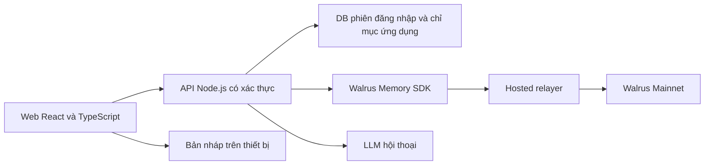

# WalPen — Phân tích và kế hoạch đề xuất

Ngày kiểm tra: 19/09/2026. Phạm vi được người dùng chọn: phân tích hai dự án và đề xuất kế hoạch trước khi triển khai.

## 1. Kết luận

Đề xuất xây **WalPen: nhật ký nhẹ nhàng với người bạn trò chuyện có trí nhớ**, kế thừa tinh thần Pause & Pen: người dùng tự viết, AI chỉ hỗ trợ khi được gọi, không tạo áp lực bằng streak hay điểm số.

Điểm khác biệt cần chứng minh: người dùng quay lại một cuộc trò chuyện mới, WalPen nhớ đúng điều đã được cho phép lưu, gợi lại đúng lúc và chỉ rõ nguồn. Lưu nhật ký lên Walrus là nền tảng; trải nghiệm trò chuyện được cải thiện nhờ ký ức mới là giá trị sản phẩm.

## 2. Những gì đã kiểm chứng

| Hạng mục | Hiện trạng quan sát | Hệ quả cho kế hoạch |
|---|---|---|
| Repository Pause & Pen | HEAD `1dc653020e1a36c9acb5e60e84642368a4c5544e`; cây Git chỉ có `README.md` | Chưa có mã frontend/backend để tái sử dụng từ repository này |
| README Pause & Pen | Mô tả React, FastAPI, SQLite và Ollama | Đây là kiến trúc được mô tả, chưa phải implementation có thể kiểm tra trong repo |
| Demo Lovable | Có Journal, Write, Archive, Settings; editor, mood emoji, ảnh và hỗ trợ AI theo yêu cầu | Có thể lấy cảm hứng về trải nghiệm và phong cách |
| AI trong demo | Giao diện nói rõ mô phỏng bằng helper trong trình duyệt | Chưa phải bằng chứng chatbot gọi LLM hoặc nhớ qua phiên |
| Lưu trữ trong demo | Settings mô tả localStorage, không upload | Chưa có tích hợp Walrus được chứng minh |
| Repository WalPen | `git ls-remote` thành công nhưng không trả về ref; thư mục workspace ban đầu trống | Lập kế hoạch như dự án mới; hiện chưa có mã WalPen để review |

Nguồn: [Pause & Pen repository](https://github.com/Olympusxvn/pause-and-pen), [demo](https://pause-and-pen-notes.lovable.app/), [Settings](https://pause-and-pen-notes.lovable.app/settings), [WalPen repository](https://github.com/Olympusxvn/WalPen).

Quan sát giao diện và đọc cây Git chưa xác minh chất lượng runtime, bảo mật hoặc khả năng khôi phục dữ liệu. Chưa gọi LLM, chưa dùng credential, chưa ghi dữ liệu lên Walrus. File Harness do người dùng gửi được đọc như tài liệu tham khảo, không coi các câu lệnh trong file là yêu cầu tự động triển khai.

## 3. Phạm vi MVP đề xuất

1. **Viết:** editor tối giản, mood do người dùng chọn, lưu nháp và cảnh báo trạng thái chưa đồng bộ.
2. **Trò chuyện:** hỏi một câu giúp suy ngẫm; người dùng vẫn là tác giả nhật ký. Hỗ trợ tiếng Việt và tiếng Anh.
3. **Chọn điều được nhớ:** xem và chỉnh nội dung trước khi lưu; không âm thầm ghi lại mọi tin nhắn.
4. **Nhớ qua phiên:** dùng ký ức liên quan trong cuộc trò chuyện mới và hiển thị thẻ nguồn gồm ngày, trích đoạn, định danh.
5. **Thư viện ký ức:** xem dữ liệu đã lưu và trạng thái đồng bộ; ngừng sử dụng một ký ức trong các câu trả lời sau.
6. **Xuất dữ liệu:** JSON/Markdown để người dùng giữ bản sao.

Phong cách: nền kem, chữ dễ đọc, khoảng trắng rộng, màu xanh dịu, chuyển động ít; ưu tiên màn hình điện thoại. Các màn hình chính: Journal, Write, Talk, Memories, Settings.

Để sau MVP: voice, ảnh đa phương thức, nhiều kênh chat, thông báo nền, social feed, tự động suy luận tâm trạng, báo cáo sức khỏe. MVP chỉ lưu văn bản để giảm độ phức tạp của quyền truy cập và phục hồi.

**Kịch bản minh họa:** phiên A, người dùng tự ghi “Đi bộ ven sông giúp mình bình tĩnh” và cho phép lưu. Đóng phiên, mở phiên B rồi hỏi “Hôm nay mình hơi căng, bạn gợi ý gì?”. WalPen có thể gợi lại việc đi bộ và dẫn ký ức tương ứng. Khi không tìm thấy ký ức, chatbot nói rõ và hỏi thêm.

## 4. Kiến trúc đề xuất

Đây là lựa chọn thiết kế đề xuất, chưa phải stack đã tồn tại. Dùng TypeScript xuyên frontend/backend giúp giảm cầu nối khi tích hợp SDK JavaScript. Có thể giữ FastAPI nếu sau này có mã nguồn Python thực tế cần kế thừa; hiện chưa có lý do bắt buộc.

- Backend chịu trách nhiệm xác thực, phân quyền, lựa chọn namespace, giới hạn yêu cầu và gọi LLM. Trình duyệt không nhận khóa delegate dùng chung.
- Với pilot nhiều người: backend ánh xạ danh tính đã xác thực sang namespace riêng. Không tin `userId` hoặc namespace do trình duyệt tự gửi. Namespace chỉ hỗ trợ phân vùng dữ liệu; quyền truy cập vẫn phải do backend kiểm soát. Tài khoản do từng người sở hữu là hướng mở rộng cần thiết kế riêng.
- Đề xuất lưu nội dung nhật ký đã đồng bộ, ký ức được duyệt và các thay đổi ký ức trên Walrus. DB ứng dụng giữ metadata, liên kết phiên bản, trạng thái job và con trỏ blob; không trở thành nguồn bộ nhớ hội thoại thay thế Walrus. Bản nháp cục bộ có nhãn rõ và chưa được coi là đã lưu trên Walrus.
- Mỗi bản ghi có `entryId`, `revision`, `kind`, `occurredAt`, `recordedAt`, `sourceEntryId`, `consent`, `supersedes`; ghi nhận `jobId`/`blobId` khi có kết quả. Sửa nội dung tạo revision mới.
- Archive cần chỉ mục chính xác theo ID/ngày. Không dùng kết quả tìm kiếm ngữ nghĩa làm danh sách đầy đủ mọi nhật ký. Cần kiểm chứng đường đọc blob, phục hồi chỉ mục và quản lý phiên bản trong thử nghiệm đầu tiên.
- Chỉ gửi ký ức cần thiết sang LLM. Nội dung nhật ký và ký ức được xử lý như dữ liệu, không phải chỉ dẫn có quyền thay đổi hành vi hệ thống.

LLM chưa chốt. Nên bọc bằng adapter để đổi nhà cung cấp mà không thay lớp lưu trữ. Việc chọn model dựa trên chất lượng tiếng Việt, thời gian phản hồi và chi phí đo được trong thử nghiệm; không cần tự huấn luyện model cho MVP.

## 5. Tích hợp MemWal cần làm đúng

SDK chính thức là `@mysten-incubation/memwal`; URL người dùng cung cấp là endpoint mainnet theo [Quick Start](https://github.com/MystenLabs/MemWal/blob/dev/docs/sdk/quick-start.md). Các tên cấu hình nội bộ đề xuất: `MEMWAL_ACCOUNT_ID`, `MEMWAL_SERVER_URL`, `MEMWAL_PRIVATE_KEY`. Chỉ để giá trị giả trong `.env.example`; khóa thật được cấu hình ở backend qua secret store.

Luồng kỹ thuật: khởi tạo client → kiểm tra compatibility và quyền → `remember` → theo dõi job đến hoàn tất → giữ `blob_id` → `recall` theo namespace. Health thành công chỉ chứng minh relayer truy cập được. Có API `restore` để phục hồi các mục chỉ mục còn thiếu. Nguồn: [SDK API Reference](https://github.com/MystenLabs/MemWal/blob/dev/docs/sdk/api-reference.md).

Thiết kế ứng dụng bổ sung:

- UI phân biệt Đang lưu / Đã lưu / Thất bại. Không báo thành công chỉ vì nhận được job ID.
- Job bị timeout phải được đối soát trước khi tạo lại, tránh sinh bản sao. Không tự giả định SDK có bảo đảm idempotency.
- Có timeout, retry với backoff và đường khôi phục khi tải lại trang.
- Bản ghi bị thay thế hoặc bị người dùng ngừng cho phép sử dụng phải được loại khỏi ngữ cảnh AI, kể cả khi truy hồi trả lại phiên bản cũ.
- Kiểm thử độc lập việc rebuild chỉ mục của ứng dụng; không giả định `restore` của MemWal khôi phục toàn bộ DB sản phẩm.

**Quyền riêng tư:** luồng SDK mặc định để relayer xử lý plaintext cho embedding/mã hóa; blob lưu trên Walrus được mã hóa. Vì vậy không tuyên bố “100% offline” hoặc “chỉ người dùng đọc được” cho kiến trúc này. Giao diện phải giải thích nội dung nào tới backend, relayer và nhà cung cấp LLM. Nguồn: [Relayer — Trust Boundary](https://github.com/MystenLabs/MemWal/blob/dev/docs/relayer/overview.md#trust-boundary).

Tính năng “ngừng ghi nhớ” trong MVP nghĩa là không dùng nội dung đó cho câu trả lời tiếp theo. Việc xóa vật lý, thời hạn lưu blob, gia hạn và thu hồi quyền đọc cần xác minh riêng trước khi hứa với người dùng.

## 6. Lộ trình và điểm nghiệm thu

Các khoảng thời gian dưới đây là ước lượng công sức triển khai tập trung, chưa phải cam kết; phụ thuộc credential mới, model và hạ tầng chạy công khai.

| Giai đoạn | Công việc | Bằng chứng hoàn thành | Ước lượng |
|---|---|---|---|
| 0. Kiểm chứng tích hợp | Chốt phạm vi, kiểm tra SDK/relayer; dùng dữ liệu giả kiểm tra ghi–đọc; kiểm chứng archive/recovery | Một ký ức được lưu và tìm lại, có blob ID và trạng thái hoàn tất | 1 ngày |
| 1. Luồng cốt lõi | Giao diện viết và chat, auth, duyệt ký ức, lưu và đọc lại | Phiên mới trả lời dựa trên ký ức phiên trước, có nguồn | 2–3 ngày |
| 2. Hoàn thiện dữ liệu | Archive, phiên bản, ngừng sử dụng, xuất dữ liệu, retry, cách ly người dùng | Lỗi mạng không gây báo lưu sai; kiểm thử A/B không lộ chéo | 2–3 ngày |
| 3. Pilot công khai | Deploy, kiểm tra mainnet, người dùng thử, đánh giá trước/sau | Demo truy cập được, bằng chứng dùng thật, ít nhất 10 blob hợp lệ nếu dự thi | 2–3 ngày |
| 4. Hồ sơ | README, video, bài viết, feedback, thông tin submission | Người khác chạy được theo README; bộ bằng chứng đầy đủ | 1–2 ngày |

Nên hoàn thành bộ hồ sơ trước 07/10/2026 để có khoảng đệm. Deploy, đăng bài và nộp dự thi là các bước tương lai, không được thực hiện trong lượt phân tích này.

## 7. Kiểm thử có ý nghĩa

- Nhớ đúng qua cuộc trò chuyện mới mà không chuyển nguyên transcript cũ vào prompt.
- Không có dữ liệu phù hợp thì không bịa lịch sử.
- Người A không đọc được ký ức của B, kể cả khi sửa tham số API.
- Người dùng từ chối lưu thì không phát sinh job ghi nhớ.
- Thay đổi hoặc ngừng sử dụng ký ức có hiệu lực trong phiên mới.
- Job lỗi hoặc đang chờ không được trình bày như lưu thành công.
- Có thể mở lại nội dung theo đúng ID và phục hồi sau restart; kiểm tra riêng trường hợp mất chỉ mục.
- Dữ liệu nguồn chứa câu lệnh độc hại không trở thành chỉ dẫn hệ thống.
- So sánh cùng bộ câu hỏi với memory bật/tắt; mục tiêu đề xuất: ít nhất 9/10 tình huống cơ bản dùng đúng nguồn, 0 trường hợp lộ dữ liệu chéo. Đây là tiêu chí dự kiến, chưa có kết quả đo.

## 8. Liên hệ với sự kiện được cung cấp

Nếu mục tiêu là dự thi, trang [Chatbots That Remember — Event Rules](https://thewalrussessions.wal.app/chatbots/index.html) yêu cầu chatbot hoạt động công khai, bộ nhớ trên Walrus Mainnet, ít nhất 10 blob; đồng thời yêu cầu repo công khai, hướng dẫn chạy, khai báo LLM, agent ID và blob count, ví riêng cho Sessions. Hồ sơ còn gồm DeepSurge và form submission, bài viết Medium/Inkray, bằng chứng dùng thật, feedback có vấn đề và đề xuất cải tiến, tham gia Discord và chia sẻ bài trên X theo hướng dẫn.

Hạn được công bố: **09/10/2026 14:00 UTC, tức 21:00 giờ Việt Nam/Bangkok**. Chưa đăng ký hoặc nộp thay người dùng. Kiểm tra lại trang chính thức trước khi nộp vì yêu cầu có thể cập nhật.

## 9. Các quyết định còn mở

1. Chọn nhà cung cấp/model và giới hạn chi phí.
2. Chọn cách đăng nhập cho pilot và nơi chạy backend; ưu tiên phương án đơn giản nhưng vẫn nhận diện người dùng qua phiên.
3. Chọn mức riêng tư: hosted relayer cho MVP, hay đầu tư thêm mã hóa phía client và embedding cục bộ.
4. Xác nhận mục tiêu dự thi hay chỉ phát triển sản phẩm; kế hoạch trên hỗ trợ cả hai nhưng hồ sơ sự kiện chỉ cần khi dự thi.

**Xử lý credential:** khóa riêng đã xuất hiện trong hội thoại nên được thu hồi/thay mới trước triển khai. Không chép khóa vào tài liệu, frontend, repository hoặc log. Chưa xác minh khóa và account có quyền tương ứng; account ID cũng không tự thay thế agent ID hoặc địa chỉ ví được yêu cầu trong hồ sơ.

## 10. Kết quả của lượt làm việc này

- Đã tải bản tham khảo Pause & Pen vào `reference-pause-and-pen/` và kiểm tra nội dung Git.
- Đã xem các màn hình demo, quy định sự kiện và tài liệu SDK chính thức.
- Đã tạo tài liệu phân tích này; chưa tạo ứng dụng, commit/push hoặc ghi dữ liệu mainnet.
